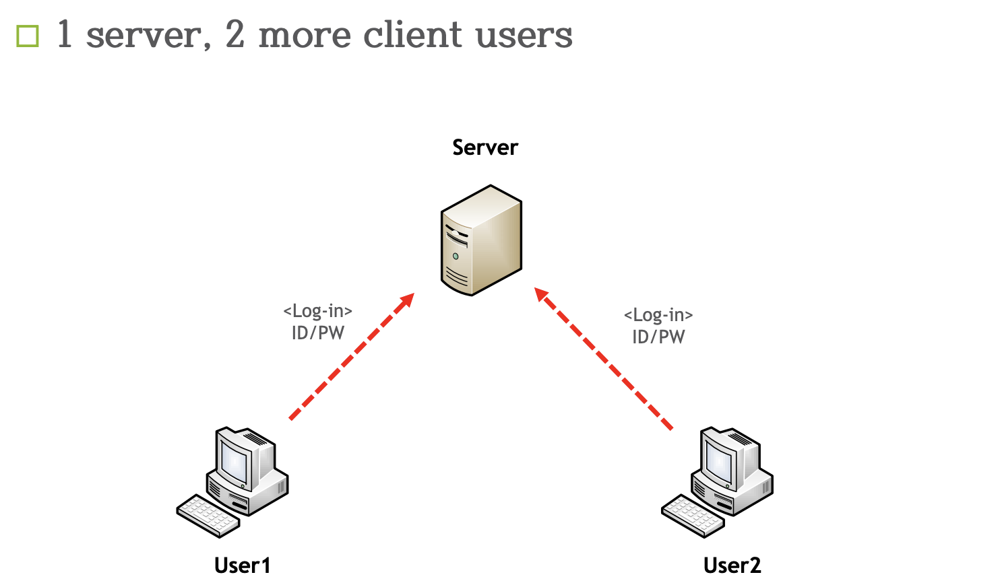
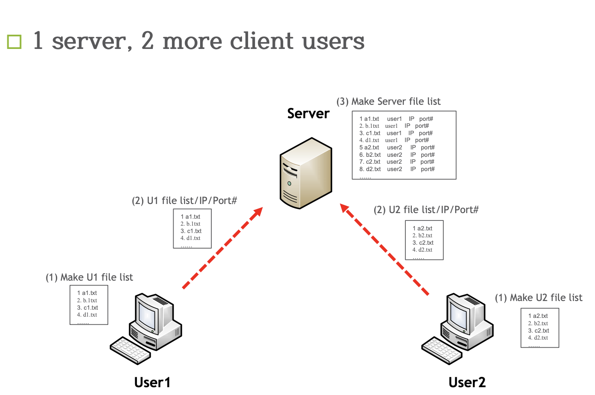
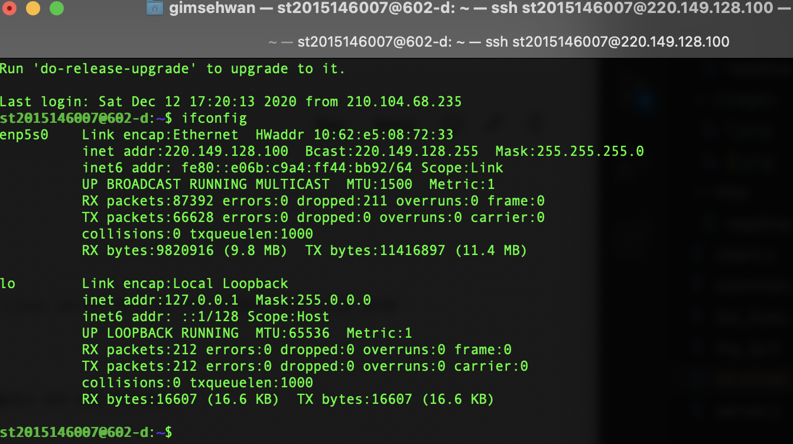
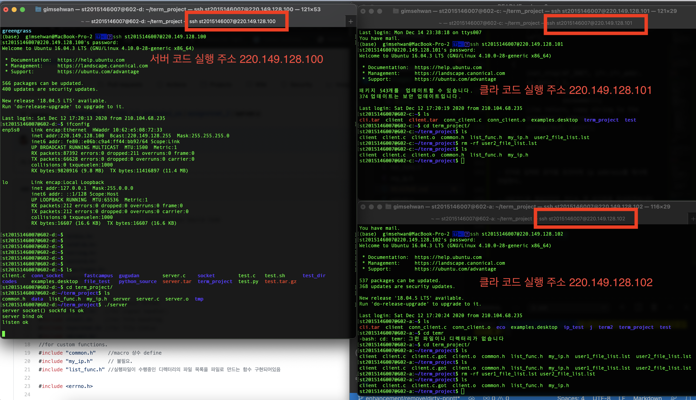
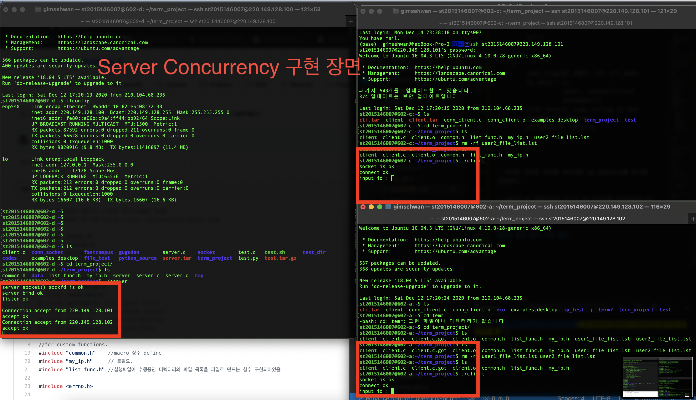
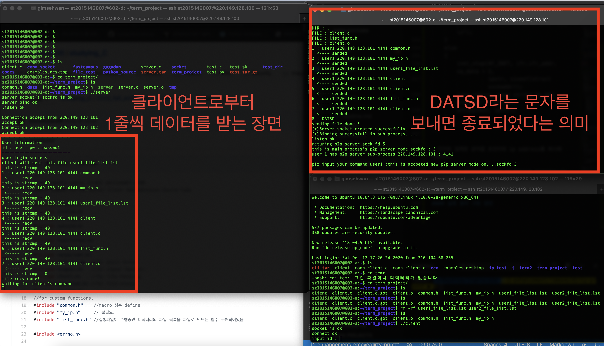
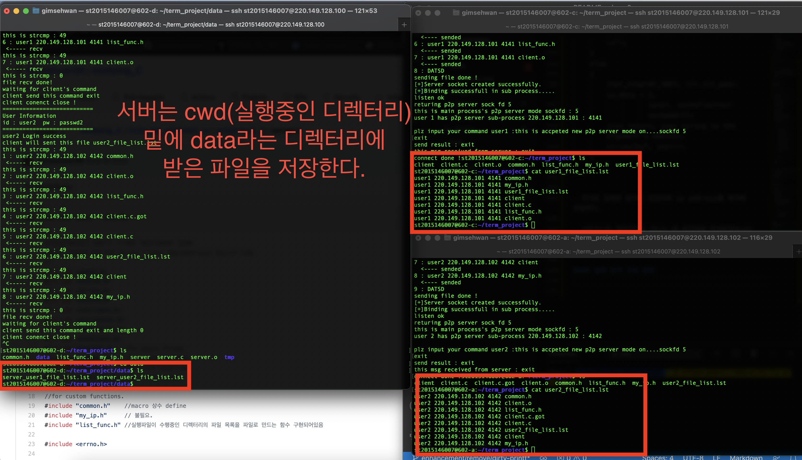
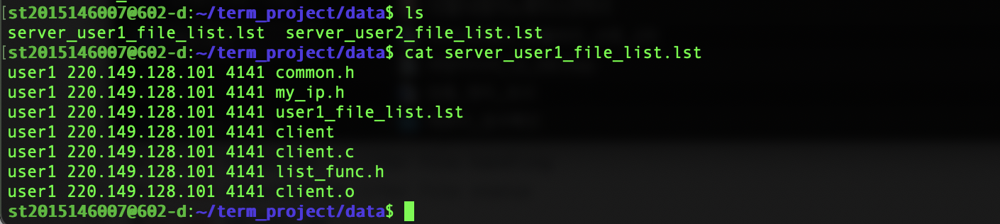

# 2020 가을학기 KPU 임베디드 운영체제 텀프로젝트 2 & 3

### 2018146005 김다은
### 2015146007 김세환

- 구조
    - client.c
        - 클라이언트 측 코드
    - server.c
        - 서버 측 코드
    - common.h
        - 클라이언트와 서버가 동시에 쓸 함수들(파일 송,수신 및 그외 유용한 매크로 정의)
    - my_ip.h
        - 학교 linux서버의 네트워크 인터페이스인 enp5s0 의 ip address를 입력한 문자열에 복사하는 함수 정의
    - list_func.h
        - 해당 코드가 실행중인 디렉터리의 파일 리스트를 만들어주는 코드

### 텀프로젝트 2번



- Sever Concurrency 구현




1. 각 클라이언트는 자신의 디렉터리에 있는 파일을 리스트화 해서 파일로 만든다.

2. 서버는 각 클라이언트로부터 받은 리스트 파일을 합쳐서 갖는다.


#### 클라이언트의 리스트 파일 생성 코드

- `list_func.h` 라는 헤더파일로 작성한다.
- `opendir()` 시스템 콜을 이용하여 디렉터리 포인터를 연다.
    - `readdir()` 시스템 콜을 이용하여 디렉터리 내 inode들을 모두 체크한다.
    - `readdir()`이 null 일 때 까지 반복 순회
    - 파일 일 경우 client 코드가 실행되는 작업공간에 user{token}_file_list.lst 형태로 파일을 생성한다.

- <strong>list_func.h</strong>

```c
#include <stdio.h>
#include <stdlib.h>
#include <dirent.h>
#include <unistd.h>
#include <string.h>
#include <fcntl.h>
#include <sys/stat.h>

#define LIST_FILE_NAME "_file_list.lst"

// for now it just print
// we will make a file with name file_list.lst for server side use.
//with arguments username & ip address

void mklistf(const char *username, const char *ipinfo, int portnum)
{
    /* 리스트 파일을 저장하기 위한 파일 포인터 선언 */
    FILE *fp;
    /* current work directory */
    char *cwd = (char *)malloc(sizeof(char) * 1024);
    char filename[256];
    /* 디렉터리 포인터 */
    DIR *dir = NULL;
     /* 디렉터리 구조체 */
    struct dirent *entry = NULL;

    //파일 내용을 채울 임시 버퍼
    char buf[100];
    char portnumc[10];
    //파일 정보 구조체
    struct stat info;
    getcwd(cwd, 1024);
    //for making list information file
    strcpy(filename, username);//user1
    strcat(filename, LIST_FILE_NAME); //user1_file_list.lst
    fp = fopen(filename, "w+");       //with overwriting mode
    if ((dir = opendir(cwd)) == NULL)
    {
        printf("current directory error\n");
        exit(1);
    }
    while ((entry = readdir(dir)) != NULL)

    {
        lstat(entry->d_name, &info);
        if (S_ISREG(info.st_mode)) //파일일때
        {
            printf("FILE : %s\n", entry->d_name);
            strcat(buf, username); // buf -> user1
            strcat(buf, " "); // buf -> user1 
            strcat(buf, ipinfo); // buf -> user1 192.168.0.1
            strcat(buf, " "); //
            sprintf(portnumc, "%d", portnum);
            strcat(buf, portnumc); 
            strcat(buf, " "); //
            strcat(buf, entry->d_name);//user1 192.168.0.1 fileName
            strcat(buf, "\n");
            fputs(buf, fp);
            memset(buf, 0, 100);
            /* 최종적인 파일의 형태는 username ip port  filename 의 형식*/
        }
        else if (S_ISDIR(info.st_mode)) // 디렉토리(폴더)일때
        {
            printf("DIR : %s\n", entry->d_name);
        }
        else //X
        {
            printf("this is not a file or directory !\n");
        }
    }
    free(cwd);
    closedir(dir);
    fclose(fp);
}
```


#### 클라이언트의 ip address 얻는 코드

- 최대한 하드코딩을 지양하기 위해, 자신의 특정 netwokr interface의 ip주소를 자동으로 받는 코드 작성.

- 현재 리눅스 서버의 network interface는 다음과 같다.



- 위 사진과 같이 교내 실습 리눅스 서버의 network interface의 이름은 enp5s0이다.

- <strong>my_ip.h</strong>

```c
#include <stdio.h>
#include <sys/ioctl.h>
#include <net/if.h>
#include <string.h>
#include <arpa/inet.h>

// 인자로 들어온 문자열 포인터에 현재 접속한 Linux server PC의 ip 주소 리터럴의 첫번째 주소를 넣어줌
// with strcpy
void myIp(char *buf)
{
    //인자로 들어온 buf의 사이즈가 너무 작을경우 에러 반환 로직 필요.
    struct ifreq ifr;
    char ipstr[40];
    int s;

    s = socket(AF_INET, SOCK_DGRAM, 0);
    //for our kpu linux machine, we use interface name with enp5s0.
    strncpy(ifr.ifr_name, "enp5s0", IFNAMSIZ);

    if (ioctl(s, SIOCGIFADDR, &ifr) < 0)
    {
        printf("Error\n");
        printf("check you network interface.\n");
    }
    else
    {
        inet_ntop(AF_INET, ifr.ifr_addr.sa_data + 2,
                  ipstr, sizeof(struct sockaddr));
        //no return, copy string to the argument's address.
        strcpy(buf, ipstr);
    }
}
```

- 인자로 입력한 문자열 포인터에 ip address를 복사해 전달한다.

- 서버코드와 클라이언트 코드는 맨 마지막에 작성하겠습니다 (텀프로젝트 2와 3 동일한 코드)
- 너무 깁니다.

#### 실제 동작 구현 장면

- 서버 코드는 .100번에
    - 클라 코드는 각 .101, .102번에 배포
    - 서버 코드 먼저 실행한다.




- Server concurrency 구현 장면



- user1이 파일 리스트를 서버로 전송하는 장면




- 여기서 느낀 고찰
    - 로컬 코드에서 로컬 파일을 read, write 하는 경우에는 EOF 판단이 매우 쉽다.
    - 파일의 끝을 만났을 경우 read() 시스템콜이 0을 즉시 반환하기 때문이다.
    - 혹시나 read()시스템콜이 read()요청한 값보다 작다면 blocking이 된다.
        - 이 때 블로킹이 되고 싶지 않다면 비동기 처리를 해야하며
        - 이 때 사용하는 기법이 select나 poll과 같은 기법이 있다.
        - 다중 입출력을 수행하는 코드가 아니므로 사용하지 않았다(멀티플렉싱)
    - 하지만 소켓은 파일의끝, EOF를 socket close (전송계층에서의 FIN & ACK 전송)으로 판단하는데
    - 소켓 연결을 끊지 않고 진행하기 위해서는 다음과 같은 방법들을 고안했다
        - 1. 응용계층에서 헤더/바디 구조를 만들어 패킷 데이터 사이즈, 명령어, 파일의 끝인지 아닌지 등을 구분
        - 2. 단순히 마지막 전송에 대한 문자열을 전송하여 판단
    - 여기서 구현 난이도를 따졌을 때 2번이 합리적이라고 판단해서 그렇게 구현했다
        - 저희 팀 코드에서는 DATSD
        - 절대로 권장되는 기법은 아니지만, 간단히 구현하기 위해서 그렇게 작성함

- user2도 똑같은 진행을 한 뒤
    - user1과 user2가 저장한 파일 리스트 파일 확인



- 파일 내용 확인




#### 서버 코드

```c
/*
한국산업기술대학교 임베디드 시스템과 2015146007 김세환 2018146005 김다은
임베디드 운영체제 과목 P2P Server Client Implementaion Source Code
*/
#include <stdio.h>
#include <stdlib.h>
#include <string.h>
#include <unistd.h>
#include <sys/types.h>
#include <sys/socket.h>
#include <netinet/in.h>
#include <arpa/inet.h>
#include <pthread.h>  //for posix thread
#include <signal.h>   //for signal handler.
#include <fcntl.h>    //for file handling
#include <sys/stat.h> //for file status
#include <dirent.h>
//for custom functions.
#include "common.h"    //macro 상수 define
#include "my_ip.h"     // 불필요.
#include "list_func.h" //실행파일이 수행중인 디렉터리의 파일 목록을 파일로 만드는 함수 구현되어있음

#include <errno.h>

//macro
#define SERV_IP "127.0.0.1" // 서버의 로컬 호스트 주소를 define
#define SERV_PORT 4140      //서버의 포트 번호를 define
#define BACKLOG 10
#define INIT_STATE 0
#define AFTER_STATE 1

struct p2p_file
{
    int idx;
    char user_name[20];
    char ip[40];
    int port;
    char file_name[50];
};

int make_tmp_file(int token);
void parse_file_info(struct p2p_file *file_info, int idx, FILE *stream); //file_info에 해당 idx에 해당하는 정보를을 넘겨줄 함수임.

extern int errno;

int main()
{
    int sockfd, new_fd, ftp_fd; //server 호스트의 소켓 파일디스크립터 및 새로운 연결을 정의할 new_fd
    int file_size;              //파일의 사이즈, 미사용중
    struct sockaddr_in my_addr;
    struct sockaddr_in their_addr;
    unsigned int sin_size;
    char file_name[BUFSIZE];                           //파일의 이름 -> 서버에서 유저별로 관리하기 위함
    char server_file_path[BUFSIZE] = "./data/server_"; //각 유저별로 서버에 파일을 따로 저장함.
    //서버 코드가 돌아가는 디렉터리의 하위 폴더인 data 밑에 저장함

    //for server concurrency, we will fork server process with each connection request.
    pid_t childpid;
    int rcv_byte;
    int recv_idx;
    char *buf = (char *)malloc(BUFSIZE);
    char *tmp_file_path = (char *)malloc(BUFSIZE);
    char id[20];
    char pw[20];
    char msg[512];
    int rb = 0;
    int len = 65536;

    int val = 1;
    int state = INIT_STATE;

    struct p2p_file *file_info = (struct p2p_file *)malloc(sizeof(struct p2p_file));
    FILE *p2p_stream;

    //socket TCP file descirptor
    //check sockfd condition
    if ((sockfd = socket(AF_INET, SOCK_STREAM, 0)) == -1)
    {
        perror("serverf-socket() error occured");
        exit(1);
    }
    else
    {
        printf("server socket() sockfd is ok \n");
    }

    my_addr.sin_family = AF_INET; //address family is AF_INET

    my_addr.sin_port = htons(SERV_PORT);

    my_addr.sin_addr.s_addr = INADDR_ANY; //any address can accept

    memset(&(my_addr.sin_zero), 0, 8);

    if (setsockopt(sockfd, SOL_SOCKET, SO_REUSEADDR, (char *)&val, sizeof(val)) < 0)
    {
        perror("setsockopt");
        close(sockfd);
        return -1;
    }

    if (bind(sockfd, (struct sockaddr *)&my_addr, sizeof(struct sockaddr)) == 1)
    {
        perror("bind error ");
        exit(1);
    }
    else
    {
        printf("server bind ok \n");
    }
    if (listen(sockfd, BACKLOG) == -1)
    {
        perror("Listen error");
        exit(1);
    }
    else
    {
        printf("listen ok \n\n");
    }

    memset(id, 0, sizeof(id));
    memset(pw, 0, sizeof(pw));

    sin_size = sizeof(struct sockaddr_in);

    for (;;)
    {
        new_fd = accept(sockfd, (struct sockaddr *)&their_addr, &sin_size);

        if (new_fd < 0)
        {
            perror("bind error ");
            exit(1);
        }
        printf("Connection accept from %s\n", inet_ntoa(their_addr.sin_addr));

        if ((childpid = fork()) == 0)
        { //child process
            //close(sockfd); //더이상 필요하지 않을때 (프로그램 서버측 종료시에) 종료하는게 맞음
            for (;;)
            {
                printf("accept ok \n");
                int token = 0;
                token = authenticate(new_fd, id, pw);
                if (token == USER1_LOGIN)
                {
                    memset(buf, 0, BUFSIZE);
                    *(int *)&buf[0] = 1;
                    send(new_fd, buf, sizeof(buf), 0);
                    read(new_fd, file_name, BUFSIZE);
                    printf("client will sent this file %s \n", file_name);
                    strcat(server_file_path, file_name);                           //server_user1_file_list.lst 라는 이름으로 파일 관리.
                    int fd = 0;                                                    //fd를 열어놓음
                    fd = open(server_file_path, O_CREAT | O_RDWR | O_TRUNC, 0644); //읽기쓰기 및 덮어쓰기, 실행권한
                    write_file_to_fd(new_fd, fd);                                  //파일 수신

                    for (;;)
                    {
                        printf("waiting for client's command \n");
                        bzero(buf, BUFSIZE);
                        read(new_fd, buf, BUFSIZE);
                        printf("client send this command %s \n", buf);

                        if (strcmp("exit", buf) == 0)
                        {
                            printf("client conenct close !\n");
                            strcpy(buf, "exit");
                            send(new_fd, buf, BUFSIZE, 0);
                            break;
                        }

                        else if (strcmp("show", buf) == 0)
                        {
                            int rd_bytes = 0;
                            printf("user%d requested file list ... \n", token);
                            if (make_tmp_file(token) != 1)
                            {
                                printf("error occured on server.\n");
                                send(new_fd, "exit", BUFSIZE, 0); //for exit client
                            }
                            bzero(buf, BUFSIZE);
                            strcpy(buf, "list"); //list 파일을 보내줄것이라고 이야기 해주기.
                            send(new_fd, buf, BUFSIZE, 0);
                            bzero(tmp_file_path, BUFSIZE);
                            getcwd(tmp_file_path, BUFSIZE);
                            strcat(tmp_file_path, "/tmp/");
                            strcat(tmp_file_path, "user1_tmp.lst");
                            FILE *server_list_file = fopen(tmp_file_path, "r");
                            if (server_list_file == NULL)
                            {
                                printf("error occured on FP");
                            }
                            send_file(server_list_file, new_fd);
                            printf("server send done !! \n");
                            fclose(server_list_file);
                        }
                        else if (strcmp("hello\0", buf) == 0)
                        {
                            printf("got hello from client \n");
                            strcpy(buf, "hello !!");
                            send(new_fd, buf, BUFSIZE, 0);
                        }

                        else if (strcmp("FTP", buf) == 0)
                        {
                            //FTP를 위한 모드 진입
                            strcpy(buf, "data");
                            send(new_fd, buf, BUFSIZE, 0);
                            recv(new_fd, buf, BUFSIZE, 0);
                            recv_idx = *(int *)&buf[0];
                            //여기서 tmp 파일 인덱스를 찾아서. 어떤 유저, 어떤 아이디, 어떤 포트, 어떤 파일인지 갖는다.
                            p2p_stream = fopen("tmp/user1_tmp.lst", "r+");
                            parse_file_info(file_info, recv_idx, p2p_stream);

                            strcpy(buf, file_info->file_name);
                            send(new_fd, buf, BUFSIZE, 0);
                            bzero(buf, BUFSIZE);

                            strcpy(buf, file_info->ip);
                            send(new_fd, buf, BUFSIZE, 0);
                            bzero(buf, BUFSIZE);

                            *(int *)&buf[0] = file_info->port;
                            send(new_fd, buf, BUFSIZE, 0);
                            bzero(buf, BUFSIZE);
                        }

                        else
                        {
                            printf("thre is no command like that ! : %s \n", buf);
                            strcpy(buf, "exit");
                            send(new_fd, buf, BUFSIZE, 0);
                            break;
                        }
                    }
                    close(new_fd);
                    break;
                }
                else if (token == USER2_LOGIN)
                {
                    bzero(buf, BUFSIZE);
                    *(int *)&buf[0] = 2;
                    send(new_fd, buf, sizeof(buf), 0);
                    read(new_fd, file_name, BUFSIZE);
                    printf("client will sent this file %s \n", file_name);
                    strcat(server_file_path, file_name);                           //server_user1_file_list.lst 라는 이름으로 파일 관리.
                    int fd = 0;                                                    //fd를 열어놓음
                    fd = open(server_file_path, O_CREAT | O_RDWR | O_TRUNC, 0644); //읽기쓰기 및 덮어쓰기, 실행권한
                    write_file_to_fd(new_fd, fd);                                  //파일 수신
                    for (;;)
                    {
                        printf("waiting for client's command \n");
                        bzero(buf, BUFSIZE);
                        read(new_fd, buf, BUFSIZE);
                        printf("client send this command %s and length %d \n", buf, rb);

                        if (strcmp("exit", buf) == 0)
                        {
                            printf("client conenct close !\n");
                            strcpy(buf, "exit");
                            send(new_fd, buf, BUFSIZE, 0);
                            break;
                        }

                        else if (strcmp("show", buf) == 0)
                        {
                            int rd_bytes = 0;
                            printf("user%d requested file list ... \n", token);
                            if (make_tmp_file(token) != 1)
                            {
                                printf("error occured on server.");
                                send(new_fd, "exit", BUFSIZE, 0); //for exit client
                            }
                            bzero(buf, BUFSIZE);
                            strcpy(buf, "list"); //list 파일을 보내줄것이라고 이야기 해주기.
                            send(new_fd, buf, BUFSIZE, 0);
                            bzero(buf, BUFSIZE);
                            getcwd(tmp_file_path, BUFSIZE);
                            strcat(tmp_file_path, "/tmp/");
                            strcat(tmp_file_path, "user2_tmp.lst");
                            FILE *server_list_file = fopen(tmp_file_path, "r");
                            send_file(server_list_file, new_fd);
                            printf("server send done !! \n");
                            fclose(server_list_file);
                            continue;
                        }

                        else if (strcmp("FTP", buf) == 0)
                        {
                            //FTP를 위한 모드 진입
                            strcpy(buf, "data");
                            send(new_fd, buf, BUFSIZE, 0);
                            recv(new_fd, buf, BUFSIZE, 0);
                            recv_idx = *(int *)&buf[0];
                            //여기서 tmp 파일 인덱스를 찾아서. 어떤 유저, 어떤 아이디, 어떤 포트, 어떤 파일인지 갖는다.
                            p2p_stream = fopen("tmp/user2_tmp.lst", "r+");
                            parse_file_info(file_info, recv_idx, p2p_stream);

                            strcpy(buf, file_info->file_name);
                            send(new_fd, buf, BUFSIZE, 0);
                            bzero(buf, BUFSIZE);

                            strcpy(buf, file_info->ip);
                            send(new_fd, buf, BUFSIZE, 0);
                            bzero(buf, BUFSIZE);

                            *(int *)&buf[0] = file_info->port;
                            send(new_fd, buf, BUFSIZE, 0);
                            bzero(buf, BUFSIZE);
                        }
                        else if (strcmp("hello", buf) == 0)
                        {
                            printf("got hello from client \n");
                            bzero(buf, BUFSIZE);
                            strcpy(buf, "hello !!");
                            send(new_fd, buf, BUFSIZE, 0);
                            continue;
                        }

                        else
                        {
                            printf("thre is no command like that ! : %s \n", buf);
                            strcpy(buf, "exit");
                            send(new_fd, buf, BUFSIZE, 0);
                            break;
                        }
                    }
                    close(new_fd);
                    break;
                }
                else
                {
                    printf("there is no such that inofrmation id : %s pw : %s\n", id, pw);
                    send(new_fd, "LOGIN FAIL \n", 512, 0);
                    printf("Disconnected from %s\n", inet_ntoa(their_addr.sin_addr));
                    close(new_fd);
                    break;
                }
            }
        }
    }
    close(new_fd);
    close(sockfd);
}

int make_tmp_file(int token)
{
    int n_bytes;
    int idx = 0;
    int tmp_fd;   //순회하면서 돌 fd
    FILE *tmp_fp; //fd를 file pointer로 열어버리기.
    int fd;
    FILE *fp;
    char user_token[10];
    char buf[BUFSIZE]; //유용하게 사용할 버퍼
    char *path = (char *)malloc(BUFSIZE);
    char *tmp_file_path = (char *)malloc(BUFSIZE);
    char static_path[512];
    memset(path, 0x00, BUFSIZE);
    char *tmp_file_name = (char *)malloc(BUFSIZE);
    memset(tmp_file_name, 0x00, BUFSIZE);
    DIR *dir = NULL;
    struct dirent *entry = NULL; //디럭터리에서 파일만 찾을려고 함
    struct stat info;            //파일의 속성을 파악하기 위한 구조체

    sprintf(user_token, "%d", token); //int형 user token을 문자열로 변환
    strcpy(buf, "user");              //user
    strcat(buf, user_token);          //user1
    strcat(buf, "_tmp.lst");          //user1_tmp.lst
    strcpy(tmp_file_name, buf);       //tmp_file_name에 user1_tmp.lst 문자열 저장
    //tmp_file_name == "user1_tmp.lst"
    //최초 실행 이후 원래 작업 디렉토리로 다시 이동해줘야 함.
    getcwd(buf, BUFSIZE); //서버코드가 실행중인 경로를 얻음.
    strcpy(static_path, buf);
    // /Users/gimsehwan/Desktop/ingkle/studying_C/2020_fall_embeded_os/assignmnet_2
    strcpy(tmp_file_path, buf);
    strcat(tmp_file_path, "/tmp"); // 하위 디렉터리 tmp
    strcat(tmp_file_path, "/");
    strcat(tmp_file_path, tmp_file_name);
    fd = open(tmp_file_path,
              O_CREAT | O_RDWR | O_TRUNC, 0644);
    if (fd < 0)
    {
        perror("open error fd");
        printf("this is path : %s \n", path);
        return -1;
    }
    fp = fdopen(fd, "w");
    //다시 ./data 경로를 지정하기 위해서 문자열 처리
    getcwd(buf, BUFSIZE); //서버코드가 실행중인 경로를 얻음.
    strcat(buf, "/data"); // 하위 디렉터리 /data 의 절대경로를 얻음
    // strcat(buf, tmp_file_name);
    strcpy(path, buf); //path에 buf에 담긴 경로 문자열 담아놓음
    // /Users/gimsehwan/Desktop/ingkle/studying_C/2020_fall_embeded_os/assignmnet_2/data
    if ((dir = opendir(path)) == NULL)
    {
        printf("open dir error \n");
    }

    chdir(path);
    while ((entry = readdir(dir)) != NULL)
    {
        lstat(entry->d_name, &info);
        if (S_ISREG(info.st_mode))
        {
            if ((strcmp(entry->d_name, tmp_file_name)) == 0)
            {
                continue; //임시파일 자체 이름은 패스 TODO: 다만 여러 유저의 임시파일이 있을 수 있다.
                          //디렉터리를 분리하는 편이 나아보임.
            }

            if ((tmp_fd = open(entry->d_name, O_RDWR)) < 0)
            {
                perror("open error tmp_fd");
            }

            tmp_fp = fdopen(tmp_fd, "r+");
            while (fgets(buf, BUFSIZE, tmp_fp) != NULL)
            {
                fprintf(fp, "%d : %s", idx, buf);
                fflush(fp);
                idx++;
            }
            fclose(tmp_fp);
            close(tmp_fd);
        }
    }
    printf("making file done...\n");
    free(path);
    free(tmp_file_name);
    free(tmp_file_path);
    closedir(dir);
    lseek(fd, 0, SEEK_SET); //파일 오프셋을 맨 앞으로 땡겨놓기
    close(fd);
    close(tmp_fd);
    chdir(static_path);
    return 1;
}

//입력받은 구조체 포인터에 체크한 값을 돌려준다.
void parse_file_info(struct p2p_file *file_info, int find_idx, FILE *stream)
{
    int idx;
    char user_name[20];
    char ip[40];
    int port;
    char file_name[50];
    while (fscanf(stream, "%d : %s %s %d %s", &idx, user_name, ip, &port, file_name) > 0)
    {
        if (find_idx == idx)
        {
            break;
        }
        else
        {
            continue;
        }
    }
    file_info->idx = idx;
    file_info->port = port;
    strcpy(file_info->user_name, user_name);
    strcpy(file_info->ip, ip);
    strcpy(file_info->file_name, file_name);

    fclose(stream);
}
```

### 클라이언트 코드

```c
/*
한국산업기술대학교 임베디드 시스템과 2015146007 김세환 2018146005 김다은
임베디드 운영체제 과목 P2P Server Client Implementaion Source Code
*/

#include <stdio.h>
#include <stdlib.h>
#include <unistd.h>
#include <string.h>
#include <sys/types.h>
#include <sys/socket.h>
#include <netinet/in.h>
#include <arpa/inet.h>
#include <fcntl.h> //open, close 등 파일 디스크립터 사용을 위함
#include <errno.h>
#include "common.h"    //유저 인증 로직 및 macro 상수
#include "list_func.h" //내부 파일 리스트를 생성하는 함수
#include "my_ip.h"     //ip check 함수

#define SERV_IP "220.149.128.100"
#define SERV_PORT 4140
#define INIT_STATE 0
#define AFTER_STATE 1
#define SEG 1

struct p2p_file
{
    int idx;
    char user_name[20];
    char ip[40];
    int port;
    char file_name[50];
};

extern int errno;

int setup_socket(int port);
int setup_socket_connect(char *ip, int port);

//서버와 인증 로직을 수행하기 위한 read, send, scanf 등의 함수를 하나의 flow로 함수화함
void auth_request(int fd, char *id, char *pw, char *buf)
{
    read(fd, buf, BUFSIZE);
    printf("%s", buf);
    scanf("%s", id);
    send(fd, id, strlen(id) + 1, 0);
    memset(buf, 0, BUFSIZE);
    read(fd, buf, BUFSIZE);
    printf("\n%s", buf);
    scanf("%s", pw);
    send(fd, pw, strlen(pw) + 1, 0);
    memset(buf, 0, BUFSIZE);
}

int main(void)
{
    int sockfd, fd, p2p_fd, p2p_new_fd;
    int p2p_req_fd;
    int p2p_recv_file_fd, p2p_send_file_fd;
    int rcv_byte, file_size;
    int token = 0;
    int req_file_idx;
    char my_ip[BUFSIZE];
    unsigned int sin_size;
    struct sockaddr_in dest_addr;  //서버의 어드레스
    struct sockaddr_in my_addr;    //클라이언트가 p2p 서버로 동작하기 위한 addr
    struct sockaddr_in their_addr; //p2p 요청으로 들어온 상대 유저의 ip 어드레스
    char *buf = (char *)malloc(BUFSIZE);
    char *msg = (char *)malloc(BUFSIZE);
    char *file_buf = (char *)malloc(SEG);
    char file_name[512];
    char id[20];
    char pw[20];

    int p2p_port;
    char p2p_ip[512];
    char p2p_file_name[512];

    pid_t childpid; //p2p

    sockfd = socket(AF_INET, SOCK_STREAM, 0); //socket fd

    if (sockfd == -1)
    {
        perror("socket");
        exit(1);
    }
    else
    {
        printf("socket is ok \n");
    }

    dest_addr.sin_family = AF_INET;
    dest_addr.sin_port = htons(SERV_PORT);
    dest_addr.sin_addr.s_addr = inet_addr(SERV_IP);
    memset(&(dest_addr.sin_zero), 0, 8);
    if (connect(sockfd, (struct sockaddr *)&dest_addr, sizeof(struct sockaddr)) == -1)
    {
        perror("connect");
        exit(1);
    }
    else
    {
        printf("connect ok\n");
    }
    auth_request(sockfd, id, pw, buf); //if user 1 success, we will get 1
    read(sockfd, buf, BUFSIZE);
    printf("this is token %d\n", *(int *)&buf[0]);
    token = *(int *)&buf[0];
    if (token == 1)
    { //유저 1 로그인 성공
        printf("login success user%d\n", token);
        myIp(my_ip);
        mklistf("user1", my_ip, USER1_FTP_PORT); //뒤에 인자(ip address)는 my_ip 헤더를 이용할 것.
        strcpy(file_name, "user1_file_list.lst");
        if ((fd = open("user1_file_list.lst", O_RDWR)) < 0)
        {
            perror("open() error !");
        }
        send(sockfd, file_name, BUFSIZE, 0);
        FILE *user_list_fp;
        user_list_fp = fdopen(fd, "r+");
        send_file(user_list_fp, sockfd);
        close(fd); // 유저의 최초 파일 전송 이후 child process fork.
    }
    else if (token == 2)
    {
        printf("login success user%d\n", token);
        myIp(my_ip);
        mklistf("user2", my_ip, USER2_FTP_PORT); //뒤에 인자(ip address)는 my_ip 헤더를 이용할 것.
        strcpy(file_name, "user2_file_list.lst");
        if ((fd = open("user2_file_list.lst", O_RDWR)) < 0)
        {
            perror("open() error !");
        }
        send(sockfd, file_name, BUFSIZE, 0);
        FILE *user_list_fp;
        user_list_fp = fdopen(fd, "r+");
        send_file(user_list_fp, sockfd);
        close(fd);
    }
    else
    {
        printf("login failed.");
        exit(1);
    }
    /*          클라이언트의 p2p 파일공유를 위한 서버 모드 셋업     */

    char *p2p_ip_address = (char *)malloc(512);
    // my_ip(my_ip_address); //이 클라이언트 코드가 돌아가는 ip주소 실제 배포시 사용
    strcpy(p2p_ip_address, my_ip);
    if (token == USER1_LOGIN)
    {
        p2p_fd = setup_socket(USER1_FTP_PORT); //소켓 생성

    }
    else if (token == USER2_LOGIN)
    {
        p2p_fd = setup_socket(USER2_FTP_PORT); //소켓 생성
    }
    else
    {
        printf("wrong process...\n");
        return 1; //child process done with exit code 1
    }
    sin_size = sizeof(struct sockaddr_in);

    if ((childpid = fork()) == 0)
    {
        char p2p_buf[BUFSIZE];
        char tt_buf[BUFSIZE];
        char will_recv_file_name[BUFSIZE];
        FILE *p2p_send_file;
        for (;;)
        {   
            p2p_new_fd = accept(p2p_fd, (struct sockaddr *)&their_addr, &sin_size);
            if (p2p_new_fd < 0)
            {
                perror("bind error");
                return 0;
            }

            for (;;)
            {
                //p2p main logic
                read(p2p_new_fd, p2p_buf, BUFSIZE); //filename읽음.
                strcpy(will_recv_file_name, p2p_buf);
                p2p_send_file_fd = open(p2p_buf, O_RDWR);
                p2p_send_file = fdopen(p2p_send_file_fd, "r+");
                send_file(p2p_send_file, p2p_new_fd);
                break;
            }
        }
        close(p2p_new_fd);
        close(p2p_fd);
        return 0;
    }
    /*          클라이언트의 p2p 파일공유를 위한 서버 모드 셋업 끝. listen 상태이며 accept 가능.    */
    /*          상대 클라이언트로부터 파일명을 받아서 fp열고, 스레드 호출해서 데이터 다 받고 connection 끊어내기 */

    for (;;)
    {
        printf("\nplz input your command user%d :", token);
        scanf("%s", buf);
        if ((send(sockfd, buf, BUFSIZE, 0)) == -1)
        {
            perror("send error ! ");
        }
        if ((read(sockfd, buf, BUFSIZE)) > 0)
        {
            printf("this msg received from server : %s \n", buf);
        }

        if (strcmp(buf, "exit") == 0)
        {
            printf("connect done !");
            break;
        }

        else if (strcmp(buf, "list") == 0)
        {
            fputs("wait", stdout);
            for (int i = 0; i < 50; i++)
            {
                fputs(".", stdout);
                fflush(stdout);
                usleep(10000);
            }
            fputs("\n", stdout);
            print_recv_file(sockfd);
            printf("recv done !~!");
        }
        else if (strcmp(buf, "data") == 0)
        {
            printf("which file do you want ? : ");
            scanf("%d", &req_file_idx);
            bzero(buf, BUFSIZE);
            *(int *)&buf[0] = req_file_idx;
            send(sockfd, buf, BUFSIZE, 0); //send file no.
            //여기서 서버로부터 ip, address, 파일 이름에 대한 정보를 수신하고
            //그 정보를 토대로 socket 연결을 해당 ip, address, port에 대해 connect & file recv & close 하면 끝
            read(sockfd, buf, BUFSIZE);
            strcpy(p2p_file_name, buf);

            read(sockfd, buf, BUFSIZE);
            strcpy(p2p_ip, buf);

            read(sockfd, buf, BUFSIZE);
            p2p_port = *(int *)&buf[0];

            p2p_req_fd = setup_socket_connect(p2p_ip, p2p_port);
            //connect 된 상태다. 나는 상대방 소켓으로부터 데이터를 받아야 한다.
            //먼저 받고싶은 파일의 이름을 보내주고, 그 파일을 받아버리자.
            strcpy(buf, p2p_file_name);
            printf("Requested this file : %s \n", buf);
            send(p2p_req_fd, buf, BUFSIZE, 0); //파일 이름 전송
            strcat(p2p_file_name, ".got");
            p2p_recv_file_fd = open(p2p_file_name, O_CREAT | O_RDWR | O_TRUNC, 0644); //읽기/쓰기/생성 및 0644            
            write_file_to_fd(p2p_req_fd, p2p_recv_file_fd);
            printf("recv requested file done. \n");
            close(p2p_req_fd); //p2p connection close.
            close(p2p_recv_file_fd);

        }
        else
        {
            printf("%s\n", buf);
            printf("no meaning...\n");
        }
    }
    close(sockfd);
    free(buf);

    return 0;
}

int setup_socket(int port)
{   //client가 p2p 서버로 동작하기 위해 셋업하는 함수
    //클라이언트의 자식 프로세스는 ANY ADDRESS로 listen 상태임.
    int e;
    int sockfd;
    int val = 1;
    struct sockaddr_in server_addr;
    sockfd = socket(AF_INET, SOCK_STREAM, 0);
    if (sockfd < 0)
    {
        perror("socket");
        exit(1);
    }
    printf("[+]Server socket created successfully.\n");

    server_addr.sin_family = AF_INET;
    server_addr.sin_port = htons(port);
    server_addr.sin_addr.s_addr = INADDR_ANY;

    memset(&(server_addr.sin_zero), 0, 8);
    if (setsockopt(sockfd, SOL_SOCKET, SO_REUSEADDR, (char *)&val, sizeof(val)) < 0)
    {
        perror("setsockopt");
        close(sockfd);
        exit(1);
    }

    e = bind(sockfd, (struct sockaddr *)&server_addr, sizeof(server_addr));
    if (e < 0)
    {
        perror("bind");
        exit(1);
    }
    printf("[+]Binding successfull in sub process.....\n");

    if (listen(sockfd, 10) == -1)
    {
        perror("listen");
        exit(1);
    }
    else
    {
        printf("listen ok \n");
    }
    printf("returing p2p server sock fd %d \n", sockfd);
    return sockfd;
}


int setup_socket_connect(char *ip, int port)
{   
    int e;
    int sockfd;
    int val = 1;
    struct sockaddr_in target_addr;
    sockfd = socket(AF_INET, SOCK_STREAM, 0);
    if (sockfd < 0)
    {
        perror("socket");
        exit(1);
    }
    printf("[+]P2P Client socket created successfully.\n");

    target_addr.sin_family = AF_INET;
    target_addr.sin_port = htons(port);
    target_addr.sin_addr.s_addr = inet_addr(ip);

    printf("attemp to connect %s : %d\n",ip, port);

    memset(&(target_addr.sin_zero), 0, 8);
    if (setsockopt(sockfd, SOL_SOCKET, SO_REUSEADDR, (char *)&val, sizeof(val)) < 0)
    {
        perror("setsockopt");
        close(sockfd);
        exit(1);
    }
    if (connect(sockfd, (struct sockaddr *)&target_addr, sizeof(struct sockaddr)) == -1)
    {
        perror("connect");
        exit(1);
    }
    else
    {
        printf("connect ok\n");
    }
    printf("returing p2p client sock fd %d \n", sockfd);
    return sockfd;
}
```

- common.h 헤더 파일

```c
//here will be useful common functions
/*
유저 인증 및 macro 상수를 정의하는 파일 임.
유저의 id, password를 저장하고 있으며,
유저를 구분하기 위한 token 값을 상수로 define 하여 사용함.
*/

#include <stdio.h>
#include <stdlib.h>
#include <string.h>
#include <unistd.h>
#include <sys/types.h>
#include <sys/socket.h>

#define INIT_MSG "===================\n Hi this is p2p test plz login\n ===============\n"
#define ID_REQ "input id : "
#define PW_REQ "input password : "
#define USER1_ID "user"
#define USER1_PW "passwd1"
#define USER2_ID "user2"
#define USER2_PW "passwd2"

#define USER1_LOGIN 1
#define USER2_LOGIN 2
#define LOGIN_FAIL 0
#define BUFSIZE 512
#define USER1_FTP_PORT 4141 //FTP를 위한 포트 번호
#define USER2_FTP_PORT 4142 //FTP를 위한 포트 번호


// 유저의 인증로직을 위한 함수.
unsigned int authenticate(int fd, char *id, char *pw)
{
    send(fd, ID_REQ, strlen(ID_REQ) + 1, 0); //strlen((char *)some_string +1) 인 이유는 Null 포함
    read(fd, id, sizeof(id));
    send(fd, PW_REQ, strlen(PW_REQ) + 1, 0);
    read(fd, pw, sizeof(pw));

    printf("===========================\n");
    printf("User Information\n");
    printf("id : %s  pw : %s \n", id, pw);
    printf("===========================\n");

    if (strcmp(id, USER1_ID) == 0)
    {
        if (strcmp(pw, USER1_PW) == 0)
        {
            printf("%s Login success \n", id);
            return USER1_LOGIN;
        }
        else
        {
            return LOGIN_FAIL;
        }
    }
    else if (strcmp(id, USER2_ID) == 0)
    {
        if (strcmp(pw, USER2_PW) == 0)
        {
            printf("%s Login success \n", id);
            return USER2_LOGIN;
        }
        else
        {
            return LOGIN_FAIL;
        }
    }
    else
        return LOGIN_FAIL;
}

// 파일 포인터를 입력받아서 파일의 사이즈를 리턴하는 함수

int get_file_size(FILE *stream)
{
    int fd, pos;
    if ((fd = fileno(stream)) < 0)
    {
        perror("fileno");
        return -1; //error intger return
    }
    //파일 오프셋을 0으로 설정
    lseek(fd, 0, SEEK_SET);
    //파일 오프셋을 파일의 끝으로 설정하고 크기 받아오기
    pos = lseek(fd, 0, SEEK_END);
    //다시 0으로
    lseek(fd, 0, SEEK_SET);
    return pos;
}

//파일 송신 / 수신 함수

void send_file(FILE *fp, int sockfd)
{
    int n;
    char data[BUFSIZE] = {0};
    int cnt = 0;
    while (fgets(data, BUFSIZE, fp) != NULL)
    {
        cnt++;
        if (send(sockfd, data, BUFSIZE, 0) == -1)
        {
            perror("[-]Error in sending file.");
            exit(1);
        }
        bzero(data, BUFSIZE);
    }
    cnt++;
    bzero(data, BUFSIZE);
    strncpy(data, "DATSD\0", 6); //DATSD는 전송 완료되었음을 명시하기 위해서 사용
    //보안에 취약점이 있지만 그냥 쓰자.
    send(sockfd, data, BUFSIZE, 0);
    return;
}

void write_file(int sockfd, char *store_name)
{
    int n;
    FILE *fp;
    char buffer[BUFSIZE];
    int cnt = 0;

    fp = fopen(store_name, "w+");
    while (1)
    {
        cnt++;
        n = read(sockfd, buffer, BUFSIZE);
        if (n <= 0)
        {
            break;
            return;
        }
        fprintf(fp, "%s", buffer);
        bzero(buffer, BUFSIZE);
    }
    fclose(fp);
    return;
}

void write_file_to_fd(int sockfd, int fd)
{   sleep(2);
    int n;
    FILE *fp;
    char buffer[BUFSIZE];
    int cnt = 0;
    int cmp_num;

    fp = fdopen(fd, "w");
    if (fp == NULL)
    {
        perror("open");
    }
    while (1)
    {
        cnt++;
        n = recv(sockfd, buffer, BUFSIZE, 0); //마지막에 EOF를 던져주지 않으면 블로킹 당함.
        if (n <= 0)
        { //EOF -> 소켓이 끊어지면 전달된다 (n = 0)
            // n < 0 -> recv 에러.
            break;
            return;
        }
        cmp_num = strncmp(buffer, "DATSD", 5);
        if (cmp_num == 0)
        {
            break;
            return;
        }
        fprintf(fp, "%s", buffer);
        bzero(buffer, BUFSIZE);
    }
    fclose(fp);
    return;
}

void print_recv_file(int sockfd)
{
    int n;
    char buffer[BUFSIZE];
    while (1)
    {
        n = recv(sockfd, buffer, BUFSIZE, 0);
        if (n <= 0)
        {
            break;
            return;
        }
        if ((strcmp(buffer, "DATSD")) == 0)
        {
            printf("file recv done!\n");
            break;
            return;
        }
        printf("%s", buffer);
        bzero(buffer, BUFSIZE);
    }
    return;
}
```


## 느낀점

- 하드코딩을 지양하려 했지만 여전히 많은점. 더욱 더 공부해야겠다고 느낌.

- read, write, send, recv는 파일 디스크립터를 조작(버퍼에 값을 읽고 쓰는)하는 것이며
- fput, fget, printf, fprintf 와 같은 함수들은 `표준입출력`이라는 것을 이해했다.

- 파일 디스크립터를 이용하여 파일 포인터를 얻는 fdopen()과 같은 시스템 콜을 이용하여
    - 소켓 파일디스크립터를 소켓 입력 스트림, 출력 스트림으로 분리 할 수 있음을 이해했다.
    - 표준 입출력을 사용했을때의 장점과 단점이 있는데
        - 장점
            - 표준 입출력이므로 사용하기 편한점
            - socket close(FIN)을 전송할때 입력 / 출력 스트림을 분리해 우아한 종료(graceful close)가 가능한점
        - 단점
            - fflush() 함수를 자주 호출 해야 하는 점
            - 표준입출력함수의 장점인 버퍼를 이용한 속도의 이점을 얻기 힘든점
            - 출력 / 입력 스트림을 분리해 코딩하는 것이 생각보다 난이도가 있다는 점

- 따라서 상황에 맞게 표준 입출력 함수를 이용하여 소켓통신을 할 것인지,
- write, read, send, recv와 같은 저 수준(low - level) 함수를 이용할 것인지 설계 단계에서 고려가 되어야 하겠다.